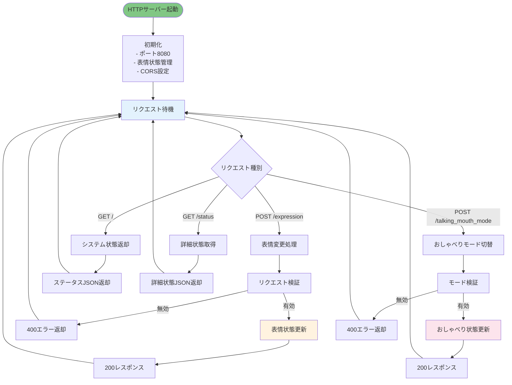
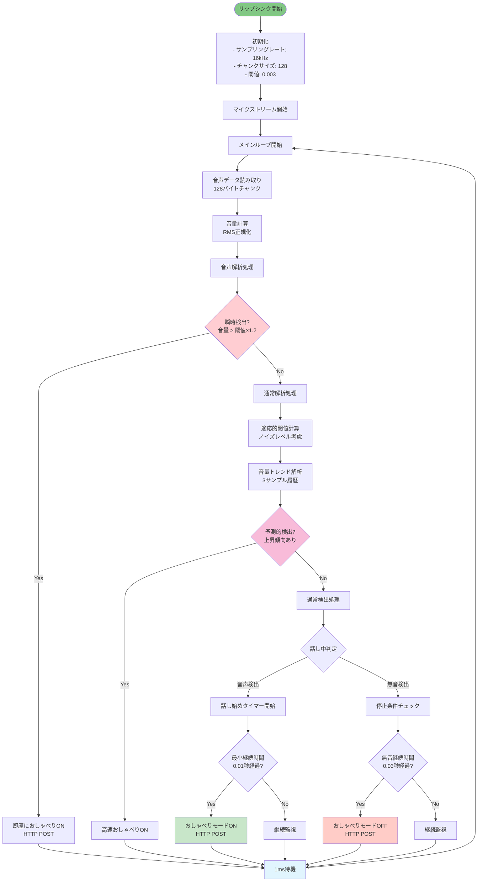
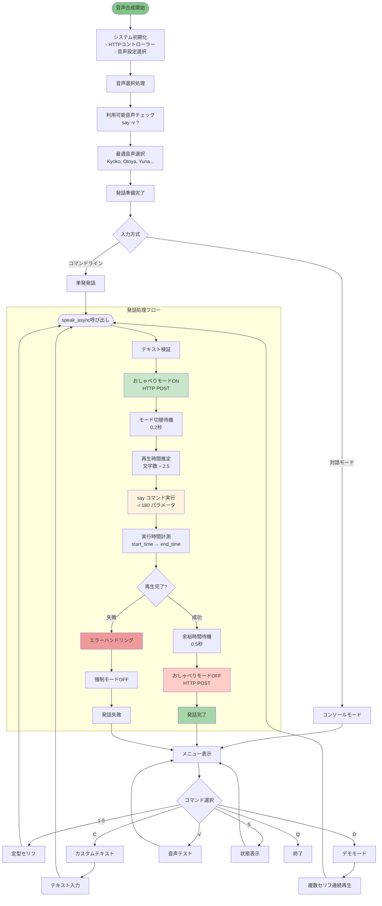
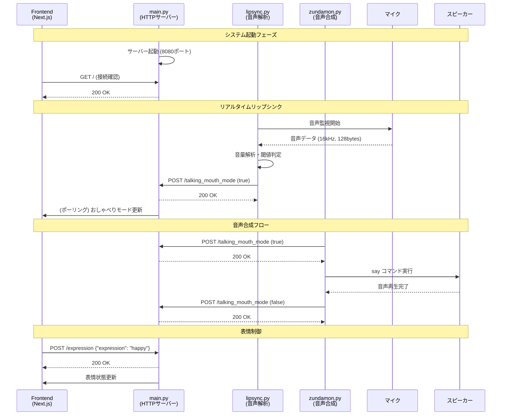

# 🤖 SIRIUS Face Animation Python Backend

顔アニメーションシステムのPythonバックエンドプロジェクトです。HTTP APIサーバーを通じて表情制御、リアルタイム音声解析によるリップシンク、音声合成システムを提供します。

## 📋 プロジェクト構成

```
python/
├── main.py              # HTTPサーバー（表情・口パク制御API）
├── lipsync.py           # リアルタイム音声解析リップシンク
├── zundamon.py          # 音声合成 + リップシンク同期システム
├── requirements.txt     # Python依存関係
└── README.md           # このファイル
```

## 🎯 システム概要

本システムは3つの主要コンポーネントで構成されています：

1. **HTTPサーバー** (`main.py`) - 表情制御API
2. **リアルタイムリップシンク** (`lipsync.py`) - マイク音声監視
3. **音声合成システム** (`zundamon.py`) - セリフ再生 + 自動リップシンク

## 🔧 システムアーキテクチャ

```mermaid
graph TB
    subgraph "フロントエンド"
        FE[Next.js Frontend<br/>顔アニメーション表示]
    end
    
    subgraph "Pythonバックエンド"
        HTTP[main.py<br/>HTTPサーバー]
        LIPS[lipsync.py<br/>リアルタイム音声解析]
        VOICE[zundamon.py<br/>音声合成システム]
    end
    
    subgraph "外部システム"
        MIC[🎤 マイク入力]
        SPEAKER[🔊 スピーカー出力]
        SAY[macOS say コマンド]
    end
    
    FE --|HTTP API呼び出し| HTTP
    HTTP --|表情・口パク状態管理| FE
    
    MIC --|音声データ| LIPS
    LIPS --|HTTP POST| HTTP
    HTTP --|おしゃべりモード制御| FE
    
    VOICE --|HTTP POST| HTTP
    VOICE --|音声合成指示| SAY
    SAY --|音声出力| SPEAKER
    
    style HTTP fill:#e1f5fe
    style LIPS fill:#f3e5f5
    style VOICE fill:#e8f5e8
```

## 🚀 各システムの詳細ロジック

### 1. HTTPサーバー (main.py)

表情制御とおしゃべりモード管理を行うRESTful APIサーバーです。



#### 🎭 表情モード一覧
- `neutral` - 通常表情
- `happy` - 喜び
- `sad` - 悲しみ  
- `angry` - 怒り
- `surprised` - 驚き
- `crying` - 泣き
- `hurt` - 痛み
- `wink` - ウィンク
- `mouth3` - 口3
- `pien` - ぴえん

#### 🔌 API エンドポイント

| メソッド | パス | 機能 | パラメータ |
|---------|------|------|-----------|
| GET | `/` | システム状態取得 | なし |
| POST | `/expression` | 表情変更 | `{"expression": "happy"}` |
| POST | `/talking_mouth_mode` | おしゃべりモード切替 | `{"talking_mouth_mode": true}` |
| GET | `/status` | 詳細状態取得 | なし |

### 2. リアルタイムリップシンク (lipsync.py)

マイク入力をリアルタイムで監視し、音声検出時に自動的におしゃべりモードをオン/オフします。



#### ⚡ 超高速化の仕組み

1. **瞬時検出**: 音量が閾値×1.2を超えたら即座に反応
2. **予測的検出**: 音量の上昇傾向を検出して先読み
3. **適応的閾値**: 環境ノイズに応じて動的調整
4. **最小遅延**: 1msサイクルでリアルタイム処理

### 3. 音声合成システム (zundamon.py)

テキストを音声合成で再生し、再生時間に合わせて自動的にリップシンクを制御します。



#### 🎵 音声パラメータ

| パラメータ | 値 | 説明 |
|-----------|----|----- |
| 読み上げ速度 | 180 wpm | Words Per Minute |
| 推定レート | 2.5文字/秒 | 保守的な時間計算 |
| 最小再生時間 | 2.0秒 | 短いテキストの最低保証 |
| タイムアウト | 20秒 | 最大処理時間 |
| 待機時間 | 0.5秒 | モード切替後の余裕時間 |

## 🔄 システム間連携フロー

全体的なシステム連携の流れを示します：



## 🛠️ インストールと実行

### 依存関係のインストール

```bash
cd python
pip install -r requirements.txt
```

### 各システムの起動

#### 1. HTTPサーバー起動
```bash
python main.py
```
- ポート: 8080
- 機能: 表情・おしゃべりモード制御API

#### 2. リアルタイムリップシンク起動
```bash
python lipsync.py
```
- マイク音声を監視
- 自動的におしゃべりモード制御

#### 3. 音声合成システム
```bash
# 対話モード
python zundamon.py

# 直接発話
python zundamon.py --text "こんにちは！"
```

## ⚙️ 設定パラメータ

### リップシンク設定 (lipsync.py)
```python
AudioAnalyzer(
    sample_rate=16000,      # サンプリングレート
    chunk_size=128,         # チャンクサイズ
    threshold=0.003,        # 音声検出閾値
    min_speaking_duration=0.01,  # 最小話し続け時間
    silence_timeout=0.03    # 無音タイムアウト
)
```

### 音声合成設定 (zundamon.py)
```python
# say コマンドパラメータ
["say", "-v", "Kyoko", "-r", "180", text]
```

## 🎯 パフォーマンス特性

| システム | 応答時間 | CPU使用率 | メモリ使用量 |
|---------|---------|----------|------------|
| HTTPサーバー | < 10ms | 低 | ~20MB |
| リップシンク | 1-3ms | 中 | ~50MB |
| 音声合成 | 再生時間依存 | 低 | ~30MB |

## 🔧 トラブルシューティング

### よくある問題

1. **マイクが認識されない**
   ```bash
   # マイクデバイス確認
   python -c "import pyaudio; p=pyaudio.PyAudio(); [print(f'{i}: {p.get_device_info_by_index(i)[\"name\"]}') for i in range(p.get_device_count())]"
   ```

2. **音声合成が動かない**
   ```bash
   # say コマンド確認
   say -v ? | grep 日本語
   say -v Kyoko "テスト"
   ```

3. **HTTPサーバーに接続できない**
   ```bash
   # ポート確認
   lsof -i :8080
   curl http://localhost:8080/
   ```

## 📈 今後の拡張予定

- [ ] VOICEVOX APIとの統合
- [ ] 複数音声エンジンの対応
- [ ] リアルタイム感情認識
- [ ] WebSocket通信での低遅延化
- [ ] 音声品質の向上

---

🤖 **SIRIUS Face Animation System** - Python Backend v1.0
